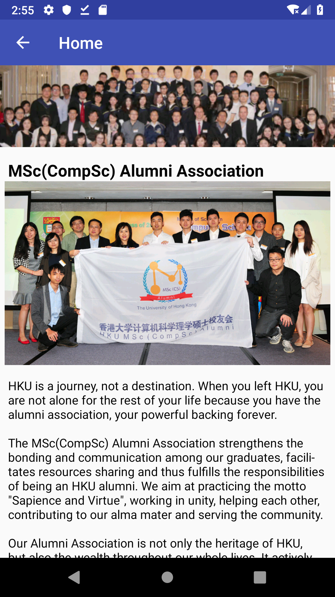
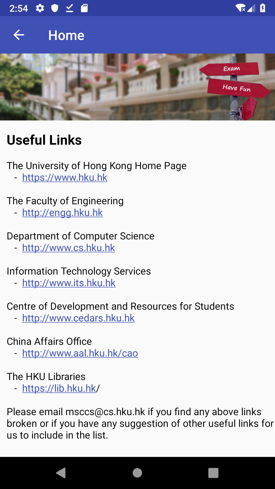

# HKU MSc(CS)

25th Nov, 2018

Group: Yuming Chen, Xiaohui Qu, Jian Wei

The HKU MSc(CS) is an Android Mobile App to promote the
MSc(CompCs) Programme at HKU. It provides almost all the basic and nesessary information which is helpful to the candidates.

## Contents

* Main page

The Main Page consists of five parts:

- The [**Drawer Menu**](#drawer-menu) (on the left and top of main page) which contains five parts

	* Admission
	* Curriculum
	* Graduate and Alumni
	* Student Resource
	* About
- The **phone button**, which can make phone call to the Msc(CS) Office (on the right and top of main page) 

- The **email button**, which can open meassge or email app in your mobile phone to send message to MSc(CS) Office (on the right and top of main page)

- The basic information about program: **Program Schedule**, **Composition Fee**, **Application Deadline** and **Program Overview**. Click these four cards to view information about this program

##  The Drawer Menu

The drawer menu is the key part of this app, and it contains most of information about MSc(CS) Program and the Department of Computer Science at HKU. You can click each item to view contents you want to know. 

### Admission
The Admission consists of **Admisson Requirements**, **Admission Procedure** and **Information Sessions**.

* **Swipe left or right on the screen** to change contents among these three parts. One can also click the navigaiton bar on the bottom of the screen to change the contnets.
*  **Scroll up and down** to view all the information on this page.
* **Click the left-arrow** on the top left of the page to go back to the main page

### Curriculum
The Curriculum consists of **Program Overview**, **Courses**, **Duration of Study** and **Regulations**.

Similarly, scrolling up and down to view the contents and swiping left or right to change the viewing parts.

### Graduate and Alumni
The Graduate and Alumni briefly introduces Msc(CompSc) Alumni Associatoin and gives the homepage <http://www.hkumsccs.com>

### Student Resources

The Student Resources gives the **frequnet asked links** that may be useful to the candidates.

### About 

The About section introduces the **professors in the department of Computer Science at HKU**, **messages from the director**  and **history about the University of Hong Kong**

